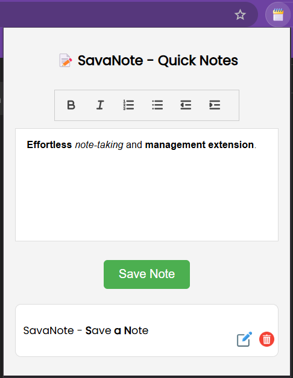

# SavaNote - Chrome Extension

SavaNote is a sleek and user-friendly Chrome extension that allows users to quickly save, edit, and manage notes right from their browser. Whether you're jotting down quick thoughts, saving important reminders, or organizing your ideas, SavaNote has you covered with a minimalistic and intuitive interface.

## Features

- **Rich Text Editing**: Use the built-in editor with Quill.js to format your notes.
- **Save Notes Locally**: Notes are stored securely using local storage for easy access.
- **Edit and Delete Notes**: Edit saved notes and remove them when no longer needed.
- **Show More/Less Notes**: Toggle between showing a limited set of notes or all saved notes.
- **Clear All Notes**: A single click to clear all notes stored locally.

## Screenshots

## Installation

1. Download the latest release or clone this repository: git clone https://github.com/PRAVEENKUMAR-V0811/SavaNote-Chrome-Extension.git
2. Go to Chrome Extensions page (`chrome://extensions/`).
3. Enable "Developer Mode" in the top right corner.
4. Click "Load unpacked" and select the directory where the project files are located.
5. The extension will be added to your Chrome toolbar.

## Usage

- **Create a New Note**: Open the extension and write your note in the rich text editor. Press "Save" to add it to your notes list.
- **Edit a Note**: Click the "Edit" button next to any note to modify its content.
- **Delete a Note**: Click the "Delete" button next to any note to remove it.
- **Clear All Notes**: Click the "Clear All Notes" button to delete all saved notes.
- **Toggle Note Visibility**: Show more or fewer notes with the "Show More" / "Show Less" button.

## Technologies Used

- **Quill.js** for the rich text editor.
- **Chrome Extensions API** for managing local storage.
- **HTML/CSS/JavaScript** for frontend development.

## Contribution

If you would like to contribute to the project, feel free to fork the repository, make changes, and submit a pull request. Here are some areas you can help with:

- Bug fixes
- Feature enhancements
- UI/UX improvements

## 👨‍💻 Author
**Praveen Kumar**  
*B.E. Artificial Intelligence and Machine Learning*  
*praveenkumarv0811@gmail.com*  
[Portfolio](https://buildwithpraveen.vercel.app/) | [LinkedIn](https://www.linkedin.com/in/praveenkumarv08)